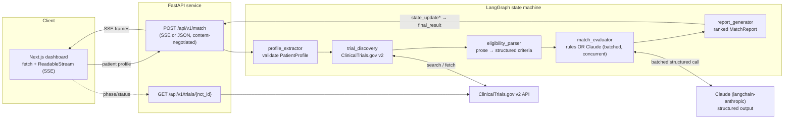

# TrialMatch AI

> **Agentic clinical-trial eligibility matching, grounded in the trial's own words.**
> Enter a patient profile → discover live trials from ClinicalTrials.gov → parse each trial's eligibility prose into structured criteria → evaluate every criterion with Claude → get a ranked report where **each verdict cites the verbatim trial text it was based on**.


<p align="center"></p>

The TrialMatch AI landing header in dark mode: gradient wordmark, tagline, and technology-stack chips (LangGraph, FastAPI, Claude, Next.js). Fully themed for both light and dark.

---

## Overview

Matching a patient to the right clinical trial is slow, manual, and error-prone: a research coordinator reads dense eligibility criteria across dozens of trials and checks each rule by hand. **TrialMatch AI automates the first pass** — it pulls candidate trials from ClinicalTrials.gov, breaks each trial's eligibility text into individual rules, and evaluates every rule against the patient, showing its work by quoting the exact trial text behind each decision. The result is a ranked, auditable shortlist a clinician can review in minutes instead of hours — helping coordinators, oncologists, and patients spend less time screening and more time on the trials that actually fit.

**TrialMatch AI** is an agentic clinical-trial eligibility matcher. Given a structured patient profile, it queries the **ClinicalTrials.gov v2** registry for candidate trials, splits each trial's free-text inclusion/exclusion criteria into discrete, structured rules, and judges every rule against the patient — producing a ranked report of `PASS` / `FAIL` / `INSUFFICIENT_INFO` verdicts with reasoning and a confidence score.

The differentiator is **grounding**: every criterion verdict carries the **verbatim criterion text** it was evaluated against, so a clinician can audit each decision against the trial's own words rather than trusting an opaque score. Orchestration is a **LangGraph** state machine; the criterion evaluator can run as a fully-deterministic rule engine (offline, no API cost) or delegate to **Claude** — and the pipeline streams its progress to a **Next.js** dashboard node-by-node over Server-Sent Events.

> ⚕️ **This is a research and educational decision-support tool — not a medical device.** Every verdict requires clinician review.

---

## Table of Contents

- [Key Features](#key-features)
- [How a Match Works (walkthrough)](#how-a-match-works)
- [Architecture](#architecture)
- [Tech Stack](#tech-stack)
- [Engineering Highlights](#engineering-highlights)
- [Getting Started](#getting-started)
- [Project Structure](#project-structure)
- [Limitations & Roadmap](#limitations--roadmap)
- [Frontend Details](#frontend-details)
- [License](#license)
- [Author](#author)
- [Screenshots](#screenshots)

---

## Key Features

### 🧬 Agentic pipeline (LangGraph, 5 nodes)

A linear LangGraph state machine threads a typed `AgentState` through five nodes: **profile intake → trial discovery → eligibility parsing → criterion evaluation → verdict aggregation**. Each node is a pure `async` function returning a partial-state update that LangGraph merges into the run.

### 📡 Live streaming (SSE)

`POST /api/v1/match` is **content-negotiated**: send `Accept: text/event-stream` and it returns a Server-Sent Events stream — one `state_update` frame per node as it completes, then a terminal `final_result` (or an `error` frame). The frontend consumes this over **`fetch` + a `ReadableStream` reader** (not `EventSource`, which is GET-only) and drives a node-by-node stepper and a live activity feed. Without the SSE header, the same endpoint returns the full report as a single JSON response.

<p align="center"></p>

The agentic pipeline streaming live. The stepper shows the first three LangGraph nodes complete with criterion evaluation active, while the activity feed logs each stage in real time over Server-Sent Events.

### 🎯 Grounded evaluation

Every criterion becomes a `CriterionVerdict`: a `verdict` (`PASS` / `FAIL` / `INSUFFICIENT_INFO`), plain-language `reasoning`, a `confidence` score, and a **`source_citation` holding the verbatim criterion text**. Verdict semantics are uniform across inclusion and exclusion rules — `PASS` always means "good for eligibility," `FAIL` always means "bad for eligibility" — so the aggregate score treats every rule consistently. The verbatim citation is a **required field** on the model, so grounding is enforced by construction rather than left to chance.

<p align="center"></p>

Grounding — the differentiator. Each criterion expands to reveal the exact verbatim eligibility text it was evaluated against, rendered as a monospace 'grounded in the trial's own words' quote beside the plain-language reasoning. A clinician can audit every verdict against the trial's actual language rather than trusting an opaque score.

### 🔀 Dual evaluator (rules + optional Claude)

The evaluator runs one of two ways, chosen by an environment flag:

- **Deterministic rule engine (default):** bounded, reproducible, fully offline per-category routing (demographics, performance status, diagnosis, prior treatment, labs, reproductive, …). This is what the entire test suite exercises — zero network, zero API cost.
- **Claude path (`TRIALMATCH_USE_LLM=1`):** each trial's criteria are sent to Claude in a **single batched structured-output call**, validated back into the `CriterionVerdict` schema. If a call fails, that trial **gracefully falls back** to the deterministic evaluator (logged as a warning, so a silent downgrade can't happen); if the model skips an index, that individual criterion falls back too.

### 📊 Results dashboard (recharts)

The results overview turns a multi-trial run into something scannable: a headline count, a verdict-distribution bar, and three **recharts** visualizations.

<p align="center"></p>

The results dashboard after a live run: the completed pipeline, a '5 trials evaluated' summary, the verdict-distribution bar, and three recharts visualizations — verdict-mix donut, trials-by-score, and criteria-by-category. Top-candidate cards surface the highest-scoring trials, and the 'Powered by Claude' bar reports exact API calls, tokens, cost, and latency for the run.

Below the overview, each trial is a **keyboard-accessible collapsible accordion** — a compact always-visible header (NCT link, title, phase/status, verdict badge, small score ring, P/F/I counts) with the full criteria table collapsed by default; only the top-ranked trial auto-expands.

<p align="center"></p>

Collapsed trial cards. Each result is a keyboard-accessible accordion whose always-visible header shows the score ring, trial title, NCT link, aggregate verdict badge, phase and recruiting status, and Pass/Fail/Insufficient counts with a gradient confidence bar — click any card to expand its full criteria table.

<p align="center"></p>

An expanded trial's criteria table: every eligibility rule with its verdict (PASS / FAIL / INSUFFICIENT_INFO), plain-language reasoning, category tag, and a confidence bar. Filter by verdict, search the criteria, and sort by confidence — here the minimal profile leaves many rules INSUFFICIENT_INFO, the honest 'not enough data' result.

Trials can be **sorted** (score / verdict / phase), **filtered** (by verdict and phase), and **searched** (title / NCT). A **By trial ↔ By verdict** toggle flips to a flattened cross-trial view so you can, for example, read every `FAIL` across all trials at once.

### 💰 Cost observability

When the Claude path runs, the per-run **model, API-call count, input/output token counts, approximate USD cost, and latency** are captured (from the model's `usage_metadata`) and ride along on the `final_result` event — surfaced in-app in a "Powered by Claude" stats bar and printed to the backend logs.

### 📄 Export (PDF + JSON)

One click exports the full report — patient profile, every trial's verdicts with reasoning and grounded citations, and the Claude usage stats — as a formatted **PDF** (generated client-side with jsPDF) or as **JSON** for programmatic use. This is the "clinical coordinator needs to save and share findings" workflow.

### 🧑‍⚕️ Sample profiles

The form ships with a **three-profile dropdown** so a first-time visitor can demo variety in one click:

- **Breast cancer · 58F (minimal)** — sparse data; most criteria resolve to `INSUFFICIENT_INFO` (the honest "not enough data" case).
- **Breast cancer · 58F (full workup)** — HR+/HER2− receptor status, five labs, prior endocrine/chemo therapy, comorbidities.
- **Lung cancer · 45M (NSCLC)** — a different sex, cancer type, ECOG 0, treatment-naive.

The richer profile measurably improves resolution: on a live run, the same trials went from **7 → 18 `PASS` verdicts** simply by supplying receptor status, labs, and prior treatments — concrete evidence that structured patient data drives better matching.

### 🎛️ Patient form & run controls

A `react-hook-form` + `zod` form with inline validation (ICD-10 pattern, age range, 2-letter country), a segmented ECOG control with grade descriptions, tag inputs for medications and prior treatments, and a **Trials to evaluate** selector (3 / 5 / 10 / All) wired end-to-end to the API's `max_results` cap — because each evaluated trial is one Claude call, this directly bounds run cost and time.

<p align="center"></p>

The patient profile form in its ready state, with the 'Ready to match' panel awaiting a run. Users enter structured data — or load a sample profile — then launch the agentic pipeline.

### 🌗 Theming & accessibility

Fully-designed **light and dark** themes (`next-themes`) built on CSS-variable design tokens — a warm-neutral base with a teal primary and indigo secondary, and green/amber/rose verdict semantics chosen for **WCAG 2.1 AA** contrast in both themes. Motion (`framer-motion`) is purposeful — staggered reveals, count-ups, a score-ring fill sheen — and every animation respects **`prefers-reduced-motion`**. Accordions are keyboard-operable with correct `aria-expanded` / `aria-controls`.

---

## How a Match Works

An end-to-end trace of a single run:

1. **Enter a patient** — fill the structured form (or load a sample profile) and pick how many trials to evaluate.
   <br>
2. **Run streams live** — the request opens an SSE stream; the pipeline stepper advances node-by-node as each LangGraph stage completes.
   <br>
3. **Read the overview** — the `final_result` lands and the dashboard renders: distribution, charts, top candidates, and the Claude cost bar.
   <br>
4. **Drill into a trial** — expand a trial to read every criterion's verdict, reasoning, and confidence.
   <br>
5. **Audit the grounding** — expand a criterion to see the verbatim trial text the verdict was based on. Export the whole thing to PDF or JSON.
   <br>

---

## Architecture

The backend is a **LangGraph** state machine exposed through a thin **FastAPI** layer. A single typed `AgentState` (a `TypedDict` with LangGraph reducers) flows through five nodes; the graph builder accepts a **dependency-injected `ClinicalTrialsClient`** so the FastAPI server can share one long-lived HTTP client and tests can inject a `MockTransport`-backed one (no network). The `/api/v1/match` endpoint is content-negotiated — the same graph run is either streamed as SSE or returned as a single JSON `MatchReport`.



**Node responsibilities:**

| Node | What it does |
|---|---|
| `profile_extractor` | Validates the structured input against the `PatientProfile` Pydantic model. |
| `trial_discovery` | Queries ClinicalTrials.gov v2 by diagnosis, filtered by locality and recruiting status; caps candidates to `max_results`. |
| `eligibility_parser` | Splits each trial's inclusion/exclusion prose into individual `Criterion` objects, routed to a category by keyword. |
| `match_evaluator` | Judges each criterion — deterministic rules or Claude (one batched structured-output call **per trial, run concurrently** with `asyncio.gather`); aggregates into a scored `TrialVerdict`. |
| `report_generator` | Assembles the ranked `MatchReport` with a framing-compliant summary ("criteria appear to be met," never "the patient qualifies"). |

The evaluator's HTTP resilience (retry/backoff on transient ClinicalTrials.gov failures) is handled with **tenacity**; SSE is served via **sse-starlette**.

---

## Tech Stack

**Backend**
- Python 3.11+ · **FastAPI** (async service layer)
- **LangGraph** (stateful multi-agent orchestration) · **langchain-anthropic** (Claude structured output)
- **Pydantic v2** (typed data contracts) · **httpx** + **tenacity** (resilient ClinicalTrials.gov client) · **sse-starlette** (SSE)
- **pytest** / pytest-asyncio · **ruff** · **mypy** (strict)

**Frontend**
- **Next.js 14** (App Router) · **TypeScript** (strict)
- **Tailwind CSS** (CSS-variable design tokens) · **framer-motion** (motion) · **recharts** (data-viz)
- **react-hook-form** + **zod** (form + validation) · **next-themes** (theming) · **jsPDF** (client-side PDF)
- **Vitest** + Testing Library

**Infrastructure**
- **Docker** (per-service Dockerfiles) · **docker-compose** (one-command local stack) · Make targets

---

## Engineering Highlights

- **Test rigor.** **155 backend tests** (unit + integration) and **60 frontend tests** (Vitest + Testing Library). The backend suite is **fully offline** — the LLM is mocked and the ClinicalTrials.gov client is backed by an httpx `MockTransport`, so the whole suite runs with **zero network in ~2 seconds**.
- **Clean gates.** `ruff` + `mypy --strict` on the backend; `tsc --noEmit` + ESLint on the frontend — all clean.
- **Grounding by construction.** `CriterionVerdict.source_citation` is a required field, and the evaluator populates it with the verbatim criterion text for every verdict — the audit trail can't be omitted.
- **Concurrent evaluation.** On the Claude path, per-trial evaluations run concurrently (`asyncio.gather`); a 10-trial run dropped from minutes (sequential) to ~60 s.
- **Cost transparency, measured live.** Real runs cost roughly **$0.04–$0.40** depending on the trial cap (≈$0.07 for 3 trials, ≈$0.18 for 5, ≈$0.40 for 10) — surfaced in-app, never hidden.
- **Structured data improves matching — with evidence.** Swapping the minimal sample for the full-workup profile (receptor status + labs + prior treatments) more than doubled resolved criteria on a live run (**7 → 18 `PASS`**).
- **Graceful degradation.** Any Claude failure falls back to the deterministic evaluator and is logged as a warning — the run always completes, and a silent downgrade is impossible.

---

## Getting Started

### Prerequisites
- **Python 3.11+** (developed on 3.12)
- **Node.js 20+**
- An **Anthropic API key** (only needed to enable the Claude evaluator; the deterministic path and all tests run without one)

### Quickest path — Docker

```bash
cp .env.example .env         # add your ANTHROPIC_API_KEY (see .env.example)
docker compose up --build
# Backend → http://localhost:8000   Frontend → http://localhost:3000
```

### Manual — backend

```bash
cd backend
python -m venv .venv
source .venv/bin/activate               # Windows: .venv\Scripts\activate
pip install -e ".[dev]"

cp ../.env.example ../.env               # add ANTHROPIC_API_KEY and MODEL_NAME
# Deterministic rules (offline, no key needed):
uvicorn trialmatch.main:app --port 8000
# …or enable the Claude evaluator:
TRIALMATCH_USE_LLM=1 uvicorn trialmatch.main:app --port 8000
```

### Manual — frontend

```bash
cd frontend
cp .env.local.example .env.local         # NEXT_PUBLIC_API_URL=http://localhost:8000
npm install
npm run dev                              # http://localhost:3000
```

Open http://localhost:3000, click **Load sample patient**, choose a profile, and hit **Find matching trials**.

### Running the tests

```bash
# Backend — fully offline, ~2s
cd backend && pytest

# Frontend
cd frontend && npm run test        # vitest
npm run lint                       # eslint
npx tsc --noEmit                   # typecheck
```

> 🔐 Secrets live only in `.env` / `.env.local`, which are git-ignored. Only the `*.example` templates (with placeholder values) are tracked — never commit a real key.

---

## Project Structure

```
trialmatch-ai/
├── backend/
│   └── trialmatch/
│       ├── agents/
│       │   ├── graph.py                 # LangGraph assembly (5-node linear pipeline)
│       │   ├── state.py                 # AgentState (TypedDict + reducers)
│       │   └── nodes/
│       │       ├── profile_extractor.py
│       │       ├── trial_discovery.py
│       │       ├── eligibility_parser.py
│       │       ├── match_evaluator.py   # rules + Claude path, concurrent, usage stats
│       │       └── report_generator.py
│       ├── main.py                      # FastAPI app factory + CORS
│       ├── api/routes/                  # health, match (SSE/JSON), trials
│       ├── models/                      # patient, trial, match, api (Pydantic contracts)
│       └── tools/clinicaltrials.py      # ClinicalTrials.gov v2 client (httpx + tenacity)
│   └── tests/                           # unit + integration (155, offline)
├── frontend/
│   └── src/
│       ├── app/                         # Next.js App Router (page.tsx, layout.tsx)
│       ├── components/                  # ProfileForm, PipelineStepper, ResultsOverview,
│       │                                #   TrialAccordion, CriteriaTable, ResultsCharts, …
│       ├── hooks/useMatchRun.ts         # SSE consumption → reducer
│       └── lib/                         # types, sse, matchReducer, trialViews,
│                                        #   profileSchema, exportReport, api
│   └── tests/                           # vitest (60)
├── docs/                                # PROJECT_PLAN.docx, images/
├── docker-compose.yml
└── README.md
```

---

## Limitations & Roadmap

**This is a research and educational decision-support tool — not a medical device.** It does not diagnose, treat, or determine eligibility; every verdict is provisional and requires clinician confirmation. Discovery and verdicts depend on the completeness of the patient profile and the trial text.

Honest current limitations and where they go next:

- **Search-term / LLM-context coupling.** The patient's diagnosis description feeds *both* the ClinicalTrials.gov condition search *and* the LLM's context. Long, highly-specific descriptions (e.g. "…stage IIB (T2N1M0)") return **zero** results from the registry's `query.cond`, so descriptions are kept searchable — which means fine-grained staging/biomarker detail can't currently ride in the discovery query. **Roadmap:** decouple the search term from the evaluation context so full staging can reach the LLM without breaking discovery.
- **Structured input only (today).** The API models a free-text clinical-note mode, but note→profile extraction is currently stubbed; the structured form is the supported path. **Roadmap:** LLM-based note extraction.
- **Grounding *check* guardrail.** Grounding is enforced *by construction* (the verbatim citation is a required field), but the standalone runtime guardrail that would reject any non-verbatim citation is planned, not yet built.
- **Deferred by design (scaffolded, not active):** LangSmith tracing, a curated evaluation harness with recall/precision metrics, PII-filtering and output-framing guardrails, human-in-the-loop clarification, and PubMed/ICD-10 enrichment. **Roadmap:** land these in priority order, starting with the eval harness.
- **Other roadmap ideas:** per-criterion streaming progress (the backend currently emits one event per node, not per criterion), authentication, and a larger built-in sample-patient library.

---

## Frontend Details

The web app has its own focused README covering the SSE consumption model, the pure/tested reducer + frame parser, the design-token system, and the component inventory: **[`frontend/README.md`](frontend/README.md)**.

---

## License

**Proprietary and source-available — not open source.** The source is published for **portfolio review, evaluation, and demonstration only**. Reading it for evaluation is welcome; using, copying, modifying, redistributing, or deploying it — in whole or in part — requires the prior written consent of the copyright holder. All rights reserved © 2026 Alireza Minagar. Bundled third-party libraries remain under their own respective licenses. See **[`LICENSE`](LICENSE)** for the full terms, including the medical/non-clinical disclaimer.

---

## Author

**Alireza Minagar, MD, MBA, MS (Bioinformatics), MS (Software Engineering)**
AI/ML Software Engineer • AWS Certified Machine Learning Engineer • Neurologist & Neuroimmunologist

Alireza Minagar is a physician-engineer working at the intersection of clinical medicine, bioinformatics, and software engineering. A neurologist and neuroimmunologist by training, he builds production AI/ML systems for healthcare — pairing first-hand clinical domain knowledge with full-stack engineering. TrialMatch AI is a flagship portfolio artifact of that intersection: a clinically-grounded, engineering-rigorous take on a real trial-enrollment problem.

- **Physician + engineer** — an MD and clinician with 290+ peer-reviewed publications who also designs, builds, and ships production software.
- **AI/ML depth** — AWS Certified Machine Learning Engineer, with graduate training in both Bioinformatics and Software Engineering.
- **Clinical-AI focus** — decision-support tools grounded in real clinical workflows and source-of-truth data, not black-box scores.

🔗 **LinkedIn:** https://www.linkedin.com/in/alireza-minagar-ai
🔗 **GitHub:** https://github.com/aliminagar/TrialMatch_2026

---

## Screenshots

All screenshots referenced above live in `docs/images/` (dark mode, ≈1440px desktop). This build ships the following captures:

- **`01-hero-dark.png`** — the landing header: gradient "TrialMatch AI" wordmark, tagline, and the technology-stack chip row.
- **`03-empty-form.png`** — the patient-profile form in its ready state, with the "Ready to match" panel in the results column.
- **`08-pipeline-running.png`** — the pipeline stepper mid-run: the first three nodes complete, criterion evaluation active, activity feed streaming.
- **`10-overview-dark.png`** — the full results dashboard: the "5 trials evaluated" headline, verdict-distribution bar, the recharts visualizations, top-candidate cards, and the "Powered by Claude" cost bar.
- **`16-trial-accordion.png`** — collapsed trial accordion cards: score ring, title, NCT link, verdict badge, phase/status, and Pass/Fail/Insufficient counts.
- **`17-criteria-table.png`** — an expanded trial's criteria table: per-criterion verdict, reasoning, category, and confidence, with the verdict filter tabs and sort/search.
- **`18-grounded-citation.png`** — criteria expanded to reveal the "grounded in the trial's own words" verbatim eligibility text — the differentiator.

---

*Created by Alireza Minagar © 2026. All rights reserved.* · [GitHub](https://github.com/aliminagar/TrialMatch_2026)
